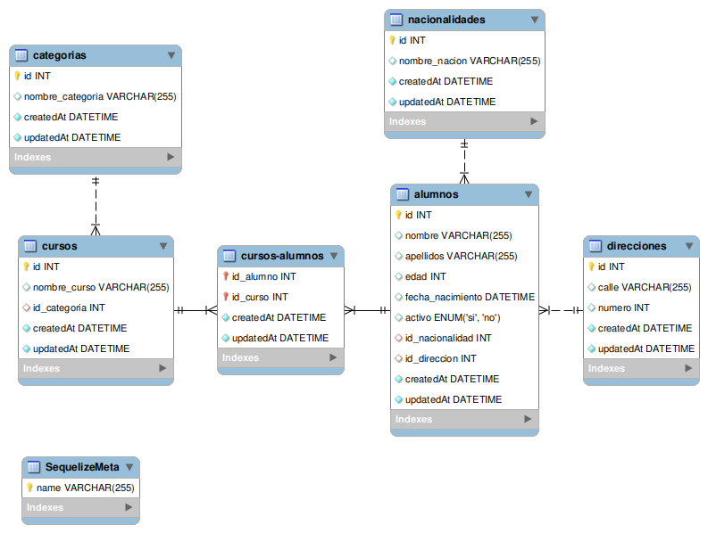

# GeeksHubs Dental Clinic Back-end

<details>
  <summary>Content 📝</summary>
  <ol>
    <li><a href="#objetivo">Objetive</a></li>
    <li><a href="#stack">Stack</a></li>
    <li><a href="#diagrama-bd">Diagram</a></li>
    <li><a href="#instalación-en-local">Installation</a></li>
    <li><a href="#endpoints">Endpoints</a></li>
    <li><a href="#agradecimientos">The Team</a></li>
    <li><a href="#contacto">Contact</a></li>
  </ol>
</details>

## Objective
In this project, we have several objectives.
1- Learn to work as a team through creating the project with a partner.
2- Create the "back-end" of a dental clinic using "Sequelize".

## Stack
Used tools:
<div align="center">
<a href="https://sequelize.org/">
    
</a>
<a href="https://www.expressjs.com/">
    
</a>
<a href="https://nodejs.org/es/">
    
</a>
<a href="https://developer.mozilla.org/es/docs/Web/JavaScript">
    
</a>
 </div>


## DB Diagram


## Local installation
1. Clone the repository
2. npm install
3. We connect our repository with the database
4. Execute the command npm run db-reset
5. npm run dev
## Endpoints
<details>
<summary>END-POINTS</summary>

- AUTH
    - Registrar alumno

            POST http://127.0.0.1:3000/auth/signin
        body:
        ``` js
            {
                "user_name":"Prueba",
                "user_surname":"Prueba",
                "user_age":"25",
                "user_phone":"12345678",
                "user_gmail":"prueba@gmail.com",
                "user_password":"1234"
            }
        ```

    - Login

            POST http://127.0.0.1:3000/auth/login
        body:
        ``` js
            {
                "user_gmail": "eugeni@admin.com",
                "user_password": "root"
            }
        ```
- ADMIN
    - Obtener todos los roles

            GET http://127.0.0.1:3000/api/admin/viewRolesAdmin

    - Obtener todas las direcciones

            GET http://127.0.0.1:3000/api/admin/viewDirectionsAdmin

    - Obtener todos los horarios

            GET http://127.0.0.1:3000/api/admin/viewSchedulesAdmin

    - Obtener todos los tratamientos

            GET http://127.0.0.1:3000/api/admin/viewTreatmentsAdmin

    - Obtener todos los usuarios

            GET http://127.0.0.1:3000/api/admin/viewUsersAdmin

    - Obtener todos las consultas

            GET http://127.0.0.1:3000/api/admin/viewInquiriesAdmin

    - Obtener todas las citas

            GET http://127.0.0.1:3000/api/admin/viewDatesAdmin

    - Modificar Un Usuario

            POST http://127.0.0.1:3000/api/admin/updateUserAdmin/3
          body:
          ``` js
              {
                "id_rol": 2
              }
          ```
- DOCTOR
    - Ver sus citas

            GET http://127.0.0.1:3000/api/doctor/viewDoctorDates/1

    - Ver sus pacientes

            GET http://127.0.0.1:3000/api/doctor/viewDoctorPatients/1
- CLIENTE
    - Ver su Perfil

            GET http://127.0.0.1:3000/api/customer/viewMyProfile/3

    - Ver sus citas

            GET http://127.0.0.1:3000/api/customer/viewDates/3

    - Crear una cita

            POST http://127.0.0.1:3000/api/customer/newUserDate
          body:
          ``` js
              {
                  "date": "2023-04-18",
                  "id_treatment": 2,
                  "id_patient": 3,
                  "id_schedule": 2,
                  "id_inquiries": 1
              }
          ```

    - Modificar una cita

            PUT http://127.0.0.1:3000/api/customer/updateUserDate/1
          body:
          ``` js
              {
                  "id_treatment": 6
              }
          ```

    - Modificar su Perfil

            PUT http://127.0.0.1:3000/api/customer/updateUserProfile/3
          body:
          ``` js
              {
                  "user_name": "Laura",
                  "user_age": 24
              }
          ```

    - Eliminar una cita
    
            DELETE http://127.0.0.1:3000/api/customer/deleteUserDates/1

</details>

## The Team:
First succesful teamwork done by:


- *Raúl Santacruz*
<a href="https://github.com/raulscz10" target="_blank"></a>

- **Leyre Romero**
<a href="https://github.com/leyreromero" target="_blank"></a>


## Contact
<a href = "mailto:raulscz10@gmail.com"></a>
<a href="https://www.linkedin.com/in/ra%C3%BAl-santacruz-b062241a1/" target="_blank"></a>
</p>

<a href = "romeroleyredev@gmail.com"></a>
<a href="https://www.linkedin.com/in/leyre-romero-24928426b/" target="_blank"></a>
</p>